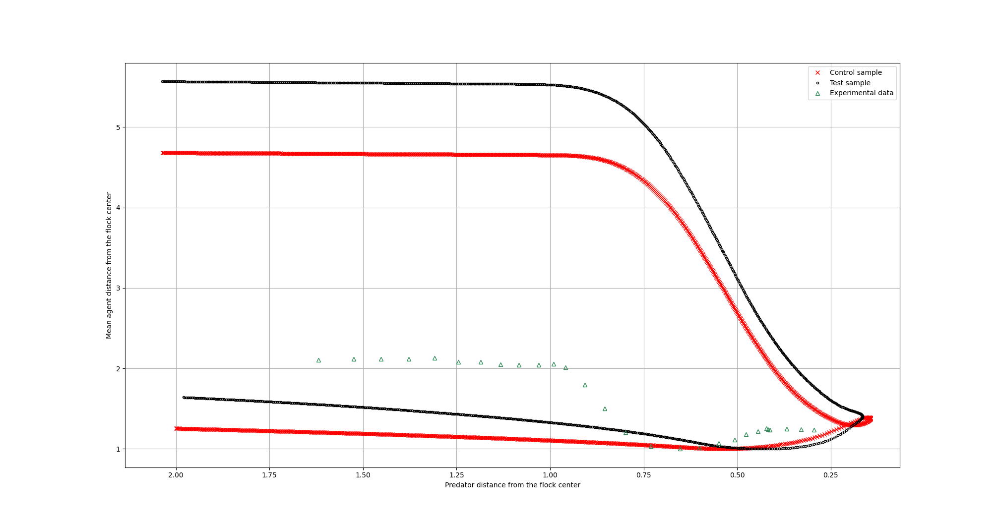
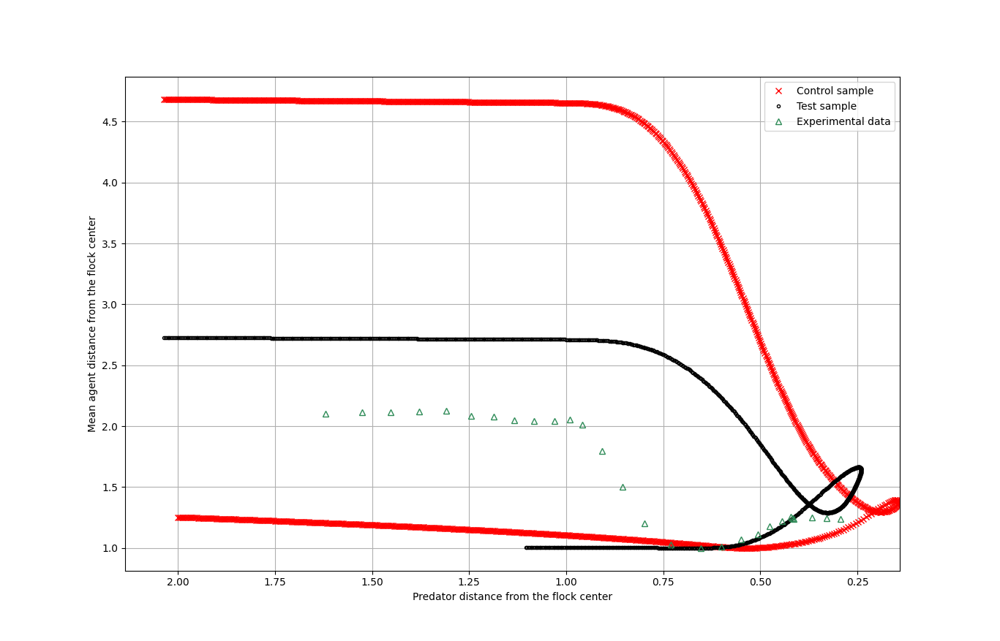
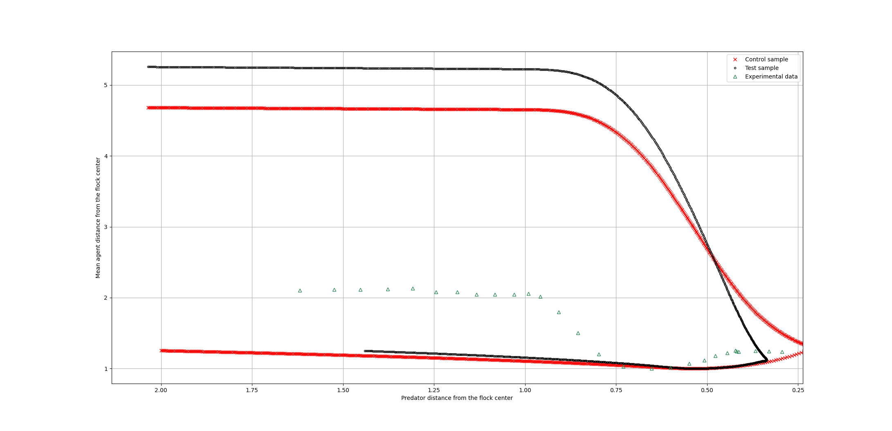
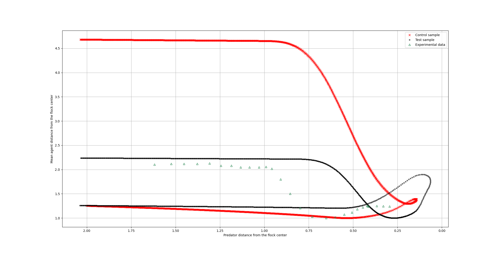
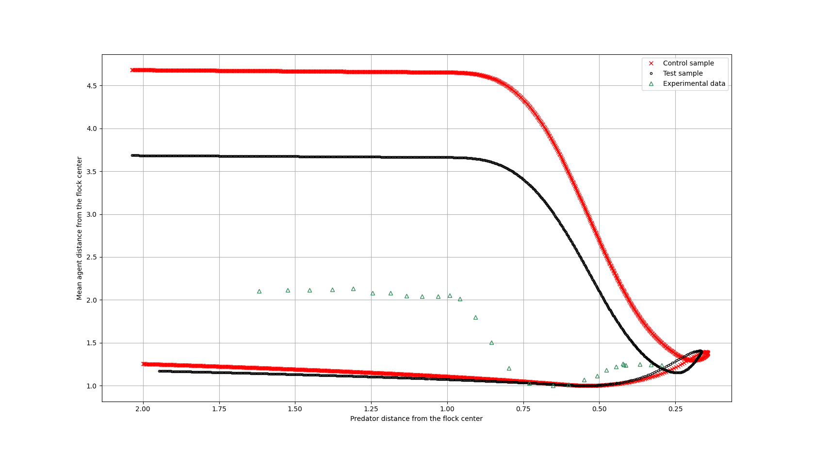
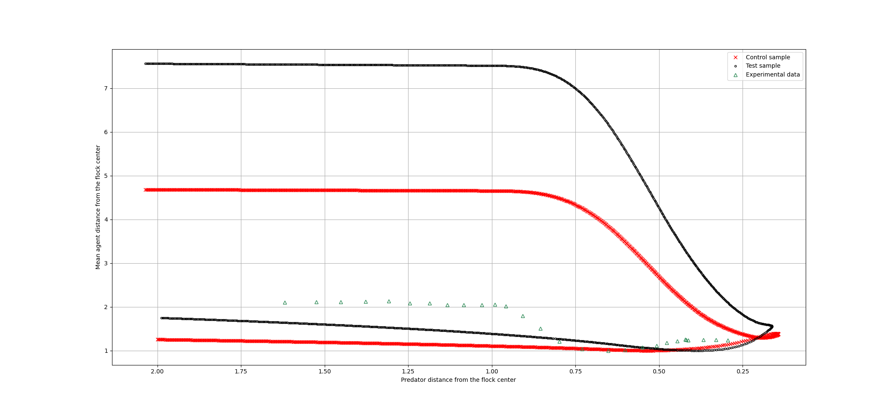
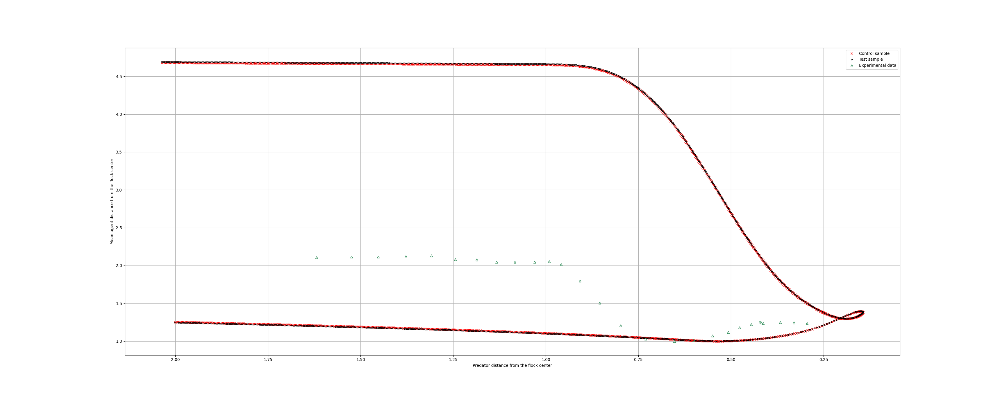
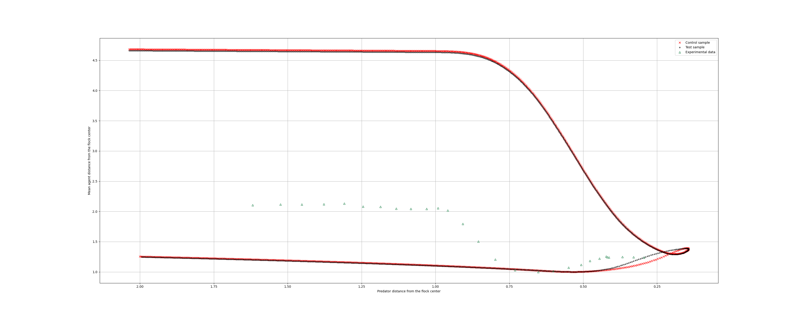
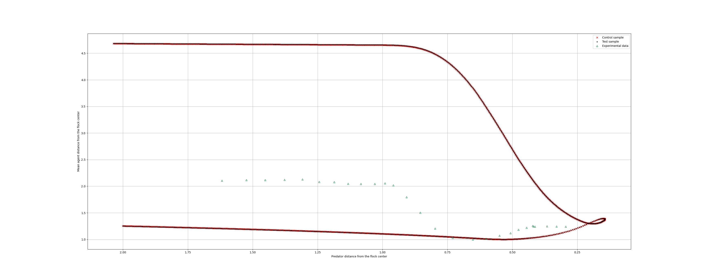

 ## This document describes the impact particular parameters have on the end result, i.e the final graph.

1. Weights:
   | Parameter name | Default value | Tested value | Impact | Data file number for the test | Plot |
   | -------------- | ------------- | ------------ | ------ | ----------------------------- | ---- |
   | Flockmate avoidance weight | 0.2 | 0.6 | increasing the weight of flockmate avoidance makes the plot higher | 2 |  |
   | Flock centering weight | 0.8 | 0.4 | decreasing the weight of flock centering makes the plot lower and stretched it horizontally | 3 |  |
   | Velocity matching weight | 0.4 | 0.8 | increasing the weight of velocity matching makes the plot change in y value steeper | 4 |  |
   | Obstacle avoidance weight | 0.2 | 0.6 | increasing the weight of obstacle avoidance greatly squishes the plot both horizontally and vertically. This parameter has great impact on the starting position of the flock which is likely the cause of the changes | 5 |  |
   | Escape weight | 6 | 8 | increasing the weight of escape decreases the difference between minimum and maximum mean distance from the flock center - the graph gets 'lower' | 1 |  |
   | Adjusted flockmate avoidance weight | 1.45 | 0.5 | Decreasing adjusted flockmate avoidance weight makes the plot higher without stretching it horizontally | 6 |  |
  
2. Basic agent movement:
   | Parameter name | Default value | Tested value | Impact | Data file number for the test | Plot |
   | -------------- | ------------- | ------------ | ------ | ----------------------------- | ---- |
   | Initial min speed | 0.7 | - | The parameter has no impact as the simulation does not use minimum velocity for now | - |  N/A |
   | Final min speed | 0.7 | - | Same as Initial min speed | -  | N/A |
   | Initial Max speed | 8 | 3 | no visible impact | 9 |  |
   | Final max speed | 16 | 9 | decreasing the value of final max speed has barely noticeable impact on the plot - the maximum y value is barely lower | 10 |  | 

3. Obstacle Avoidance
   | Parameter name | Default value | Tested value | Impact | Data file number for the test | Plot |
   | -------------- | ------------- | ------------ | ------ | ----------------------------- | ---- |
   | Obstacle Avoidance Softener | 15 | 30, 2 | no visible impact | 11, 12 |  |

4. Flockmate Avoidance
   | Parameter name | Default value | Tested value | Impact | Data file number for the test | Plot |
   | -------------- | ------------- | ------------ | ------ | ----------------------------- | ---- |
   | Flockmate avoidance radius | 6 | | | | |
   | Flockmate avoidance softener | 0.6 | | | | | 

5. Flocking
   | Parameter name | Default value | Tested value | Impact | Data file number for the test | Plot |
   | -------------- | ------------- | ------------ | ------ | ----------------------------- | ---- |
   | Flockmate detection radius | 40 | | | | |
   | Sight angle | 150 | | | | | 

6. Predator Adaptation
   | Parameter name | Default value | Tested value | Impact | Data file number for the test | Plot |
   | -------------- | ------------- | ------------ | ------ | ----------------------------- | ---- |
   | Flight zone radius | 24 | | | | |